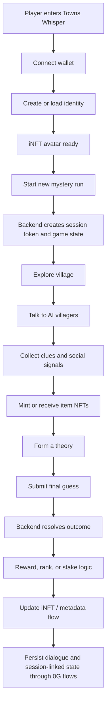
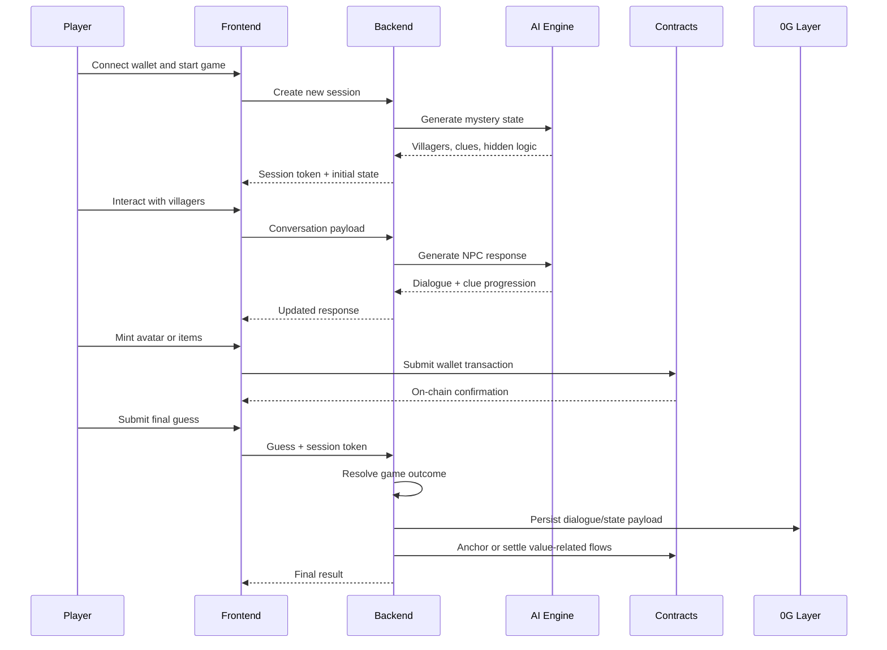
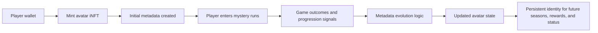
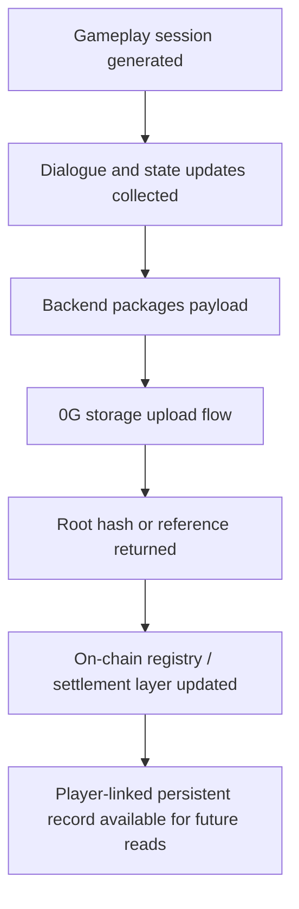
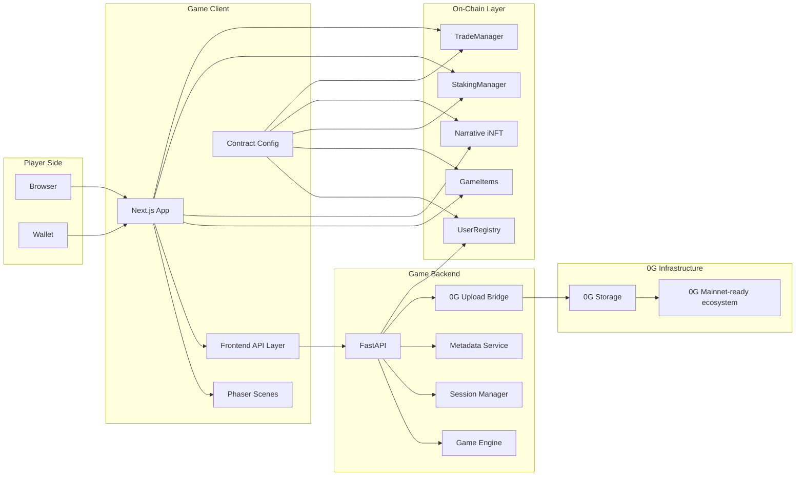

# Beyond The Fog

> **An AI-native mystery world where conversation becomes gameplay, identity becomes an evolving iNFT, and on-chain value becomes part of the player journey.**

Byond The Fog is a narrative mystery game built around three ideas:

1. **AI should create live play, not static flavor text**
2. **Player identity should persist as an on-chain intelligent asset**
3. **Game outcomes should connect to real economic behavior through 0G infrastructure**

Instead of sending players through a fixed quest tree, Towns Whisper drops them into a living village wrapped in fog, secrets, and suspicion. The player must talk, infer, collect, decide, and finally accuse. Every run becomes a different social puzzle. Every villager interaction can change the pace of discovery. Every key player action can tie back to assets, state, and rewards.

This repository contains the full product stack:

- a **Next.js + Phaser** game client
- a **FastAPI** orchestration backend
- a **Foundry-based smart contract system**
- an **iNFT identity layer**
- a **0G-integrated storage and execution design**

The project was originally developed around 0G network flows and is written here in a **mainnet-ready product framing**. Where the current codebase still reflects testnet-era addresses or environment assumptions, this README describes the intended production architecture and launch posture rather than locking the product story to a temporary deployment stage.

---

## Introduction

Most Web3 games fail in one of two ways:

- they are technically on-chain but not meaningfully fun
- they are visually interesting but use blockchain only as decoration

Towns Whisper is designed to avoid both failures.

The game loop is built around **deduction, trust, memory, and consequence**. Players arrive in a village where something is wrong. People know pieces of the truth, but no one reveals everything immediately. Progress depends on how well the player reads the social environment, interprets clues, manages risk, and acts before the mystery collapses.

What makes the system different is that the gameplay stack is not isolated from the economy stack:

- **villager dialogue** is AI-generated and session-aware
- **dialogue history** can be persisted through **0G-backed flows**
- **items** exist as on-chain assets
- **player identity** is represented as an **evolving iNFT**
- **stakes, rewards, and tradeability** can be linked to actual player outcomes

This creates a product with stronger retention hooks than a normal puzzle game:

- players return because runs feel different
- players collect because items are assets
- players care because identity evolves
- players speculate because outcomes can be economically meaningful

In short, Towns Whisper is built as a **playable mystery economy**, not just a game scene wrapped around a wallet button.

---

## Game Information

### Core premise

The player wakes inside a fog-covered settlement with incomplete context and a clear objective: uncover what happened, identify the correct hidden location, and solve the run before misinformation, bad judgment, or poor relationship management ruins the outcome.

### What the player actually does

- explores a village environment
- speaks with AI-powered NPCs
- collects clues distributed across characters and interactions
- obtains item NFTs that can support progression or status
- manages trust and familiarity with villagers
- forms a theory about the hidden truth
- locks in a final guess
- receives a result tied to game logic and on-chain systems

### Design pillars

#### 1. Social deduction over menu clicking

This is not a game where players only spam buttons until a quest marker updates. The player has to think about motive, sequence, emotional tone, and missing information.

#### 2. AI as a system, not a gimmick

Dialogue exists to drive uncertainty, pacing, and replayability. The AI layer is there to generate variation and behavioral texture, not to fill the screen with generic text.

#### 3. On-chain identity with meaning

The iNFT layer is not just a profile picture wrapper. It is intended to become the persistent player identity that reflects progression, memory, achievements, and future utility.

#### 4. Economy tied to outcomes

The game supports an ecosystem where rewards, stakes, collectibles, upgrades, and market activity can all emerge from actual play rather than arbitrary token emissions.

### Player fantasy

Towns Whisper sells a specific fantasy:

> *You are not grinding mobs. You are entering a suspicious settlement, reading people under pressure, uncovering a buried truth, and turning intelligence into advantage.*

That positioning matters because it helps the project stand out in both gaming and Web3 categories.

---

## Why This Game Can Be Profitable

This section is intentionally written from a product and business lens.

### 1. Replayability increases session value

Games become expensive when new content must be authored line-by-line for every future session. Towns Whisper reduces that burden by using AI-generated conversational variance and system-level clue distribution. That means:

- the same world can generate many play sessions
- content freshness does not require fully rewriting every run
- player curiosity has a direct retention loop

Higher replayability generally improves:

- session count per wallet
- time spent per player
- collectible attachment
- conversion into paid, staked, or premium modes

### 2. iNFT identity creates long-term player retention

Most casual games reset player value every time the player leaves. Towns Whisper can keep identity persistent through the iNFT layer. If the player's avatar evolves across runs, seasons, ranks, items, and story achievements, then the player has a reason to return beyond one mystery clear.

That supports monetizable behavior such as:

- premium identity upgrades
- prestige evolution paths
- status-linked cosmetics
- access-gated events
- secondary-market demand for rare evolved states

### 3. On-chain items are naturally monetizable

GameItems can move beyond pure utility and support:

- limited seasonal drops
- clue-tier utility items
- collectible sets
- marketplace trading
- tournament reward distribution

This turns inventory from a closed database mechanic into a more durable economic layer.

### 4. Stakes and payouts create competitive engagement

When players can enter higher-risk modes, attention rises. Even a simple stake-and-resolve structure changes the emotional texture of play. Solving a mystery matters more when a player has real value on the line.

Used carefully, this supports:

- higher-value sessions
- leaderboard seriousness
- repeat competitive attempts
- creator-driven community events
- tournament formats

### 5. 0G gives the infrastructure story real weight

The value proposition is stronger when the project can say:

- player-linked state is not purely local
- important records can be persisted through 0G-backed flows
- asset logic is compatible with a broader decentralized economy
- the architecture is built for larger network participation rather than isolated demo logic

That narrative matters for:

- ecosystem grants
- launch partnerships
- infrastructure alignment
- long-horizon community trust

### 6. This is not only a game, it is a framework

The strongest business case may not be just one game title. Towns Whisper can also become the blueprint for:

- AI-native village mysteries
- multi-chapter narrative seasons
- creator-authored story modules
- branded mystery events
- iNFT-driven identity ecosystems

If the architecture is generalized, the project becomes more than a single product. It becomes an expandable content and economy engine.

---

## How To Play

### Step 1. Enter the world

The player launches the client, connects a wallet, and enters the landing experience. From there, they transition into the narrative game flow.

### Step 2. Establish identity

The player can mint or use an avatar identity represented through the **iNFT layer**. This identity is designed to become the player's persistent on-chain presence in the game ecosystem.

### Step 3. Start a new mystery run

A new session is created by the backend. The game issues a session token and builds the current mystery state, including villagers, inaccessible locations, and hidden truth conditions.

### Step 4. Investigate the village

The player explores and interacts with villagers. Each NPC conversation can reveal:

- trust signals
- direct clues
- partial contradictions
- item opportunities
- social resistance
- misdirection

### Step 5. Collect assets and evidence

As the run progresses, players may mint or earn item NFTs connected to the game logic. These items create a stronger bond between progression and ownership.

### Step 6. Build a theory

The game is not about hearing one magic line. The player has to synthesize multiple clues and decide which interpretation is correct.

### Step 7. Make the final guess

The player chooses the target location or resolution path. The backend validates the result and resolves the session.

### Step 8. Resolve value

Depending on the game mode and future mainnet configuration, the outcome can feed into:

- ranking
- item progression
- reward handling
- stake resolution
- avatar evolution
- persistent narrative state

### Step 9. Persist the run

Important dialogue or metadata flows can be anchored through the 0G-integrated architecture so the player journey becomes part of a larger persistent system rather than disposable app state.

---

## Product Flow



---

## How The System Works

### High-level workflow



---

## Main Components

### Frontend

The frontend is built in **Next.js** and renders the playable experience through **Phaser** scenes. It handles:

- wallet connection
- player interaction flow
- scene transitions
- session persistence in browser storage
- calls to backend gameplay APIs
- contract interactions for items and identity

### Backend

The backend is the orchestration layer. It handles:

- session creation
- authentication through session tokens
- AI dialogue generation
- prompt sanitization
- rate limiting
- reward and settlement logic
- dialogue persistence
- 0G upload flows
- metadata generation and avatar update support

### Contracts

The smart contract layer exists to make progression economically and socially durable. The repo includes contracts for:

- user registry
- item NFTs
- staking and settlement
- iNFT avatar logic
- trading flows

---

## iNFT Architecture

The iNFT system is one of the most important parts of the product story.

The idea is simple:

> the player should not only own a static token; the player should own an intelligent, evolving identity asset.

### Why iNFT matters here

- it gives continuity across sessions
- it can hold metadata linked to progression
- it can become a prestige layer
- it creates stronger emotional attachment than disposable save data
- it opens the door to future interoperability, agent behavior, and personalized progression systems

### iNFT lifecycle



### iNFT as product leverage

In a mature version of the platform, the iNFT can become the center of:

- reputation
- rarity
- leaderboard prestige
- cosmetic evolution
- access control
- secondary market demand
- AI-personalized future content

That is much stronger than the usual "mint a character NFT once and forget it" model.

---

## 0G Architecture

0G is not just mentioned as infrastructure branding. It is central to how the long-term system can work.

### What 0G enables in Towns Whisper

- persistent dialogue-linked state
- decentralized storage posture for important game records
- stronger proof and continuity for player activity
- a more credible path from prototype to scalable network-native game economy

### 0G workflow



### Why this matters strategically

This means the project can evolve toward a model where:

- player progress becomes portable
- session evidence becomes auditable
- story-state persistence becomes more durable
- ecosystem trust improves because valuable records are not trapped in a closed backend

---

## Full Architecture



---

## Mainnet Positioning

This README is written with **mainnet directionality** in mind.

That means the product story should be understood like this:

- the game is built to graduate into a persistent network-native product
- the iNFT layer is meant to serve long-lived player identity
- the asset model is meant to support real market behavior
- the storage layer is meant to preserve valuable player-linked records
- the reward layer is meant to become economically relevant at scale

### Important clarification

The codebase may still contain environment variables, addresses, comments, or deployment assumptions that come from an earlier testnet phase. That is normal for an in-progress stack. The correct way to read the project is:

> **prototype and mechanics exist now; production-grade mainnet cutover is the next evolution of the same architecture**

This README therefore presents Towns Whisper as:

- **mainnet-ready in design**
- **economically meaningful in intent**
- **expandable beyond a single demo session**

---

## Repository Structure

```text
Towns-whisper/
├── game_0G/
│   ├── src/app/                  # Next.js application shell
│   ├── src/components/           # UI, landing, conversation, Phaser mount points
│   ├── src/scenes/               # Game scenes and village interactions
│   ├── src/api.js                # Frontend gameplay API client
│   ├── src/contractConfig.js     # Contract addresses and ABIs
│   └── public/assets/            # Art, music, world assets, videos
│
├── server_centralized/
│   ├── main.py                   # FastAPI app, endpoints, middleware, session handling
│   ├── game_logic/               # State engine and AI gameplay logic
│   ├── og_storage_service.py     # 0G persistence and chain-linked flows
│   ├── metadata_service.py       # Avatar/item metadata utilities
│   ├── schemas.py                # API request/response schemas
│   └── bridge_0g.js              # Node bridge for storage upload
│
├── contracts-0G/
│   ├── src/                      # Solidity contracts
│   ├── script/                   # Foundry deployment scripts
│   ├── test/                     # Contract tests
│   └── README.md                 # Foundry-specific notes
│
├── assets/
├── HOW_TO_PLAY.md
├── docker-compose.yml
└── vercel.json
```

---

## Technical Stack

### Client stack

- **Next.js**
- **React**
- **Phaser 3**
- **RainbowKit**
- **wagmi**
- **ethers**
- **Tailwind CSS**

### Backend stack

- **FastAPI**
- **Python 3.11**
- **Web3.py**
- **httpx**
- **Node.js bridge for storage upload**

### Smart contract stack

- **Solidity**
- **Foundry**

### Infrastructure direction

- **0G ecosystem**
- **iNFT-based identity**
- **on-chain assets**
- **mainnet-grade deployment path**

---

## Local Development

### Requirements

- Node.js `20+`
- Python `3.11+`
- npm
- Foundry for contract development
- a configured wallet if testing blockchain flows

### Backend setup

Create `server_centralized/.env` with values appropriate for your environment:

```env
GOOGLE_API_KEY=your_key
PRIVATE_KEY=0xyour_private_key
0G_TESTNET_RPC=https://evmrpc-testnet.0g.ai
ALLOWED_ORIGINS=http://localhost:3000
BACKEND_URL=http://localhost:3002

USER_REGISTRY_ADDRESS=your_registry_address
GAME_ITEMS_ADDRESS=your_gameitems_address
STAKING_MANAGER_ADDRESS=your_staking_address
NARRATIVE_INFT_ADDRESS=your_inft_address
TRADE_MANAGER_ADDRESS=your_trade_address
```

Run the backend:

```bash
cd server_centralized
pip install -r requirements.txt
npm install
uvicorn main:app --host 0.0.0.0 --port 3002
```

### Frontend setup

Create `game_0G/.env.local`:

```env
NEXT_PUBLIC_API_BASE_URL=http://localhost:3002
NEXT_PUBLIC_CHAIN_ID=16602
NEXT_PUBLIC_RPC_URL=https://evmrpc-testnet.0g.ai

NEXT_PUBLIC_USER_REGISTRY_ADDRESS=your_registry_address
NEXT_PUBLIC_GAME_ITEMS_ADDRESS=your_gameitems_address
NEXT_PUBLIC_STAKING_MANAGER_ADDRESS=your_staking_address
NEXT_PUBLIC_NARRATIVE_INFT_ADDRESS=your_inft_address
NEXT_PUBLIC_TRADE_MANAGER_ADDRESS=your_trade_address
NEXT_PUBLIC_WRAPPED_OG_ADDRESS=0x0000000000000000000000000000000000001001
```

Run the frontend:

```bash
cd game_0G
npm install
npm run dev
```

Open `http://localhost:3000`.

---

## Deployment Notes

### Frontend deployment

For Vercel:

- set **Root Directory** to `game_0G`
- use **Next.js** as the framework preset
- do **not** place `rootDirectory` inside `vercel.json`

### Backend deployment

Deploy the backend separately on an always-on platform such as:

- Railway
- Render
- Fly.io
- Docker-based VPS

The backend should not be treated as a trivial stateless API because it manages:

- active game sessions
- AI orchestration
- persistence logic
- privileged signing flows
- storage operations

### Mainnet migration checklist

Before presenting the product as fully live on mainnet, complete the following:

1. replace all remaining temporary addresses
2. update RPC endpoints
3. harden secret management
4. validate reward and settlement contracts under production assumptions
5. test storage persistence under realistic traffic
6. lock public documentation to final production addresses

---

## Why This Project Has Long-Term Potential

Towns Whisper is attractive because it sits at the overlap of several high-upside categories:

- AI-native gameplay
- persistent identity
- on-chain assets
- social deduction
- replayable narrative systems

That means it can grow in multiple directions:

- as a consumer game
- as a creator platform
- as a seasonal event product
- as an iNFT identity ecosystem
- as a narrative framework for future worlds

The strongest version of Towns Whisper is not just a single mystery game.

It is a **network-native narrative platform** where:

- players keep evolving identities
- stories can expand over time
- assets stay relevant across seasons
- value does not disappear when a session ends

---

## Demo And Supporting Assets

- [How To Play](HOW_TO_PLAY.md)
- [Flow diagram](assets/towns_whispers_flow.svg)
- [Walkthrough video](assets/towns_whisper_walkthrough.mp4)

---

## Contributing

High-value contribution areas:

- backend test coverage
- contract test expansion
- multiplayer or shared-world durability
- iNFT evolution logic
- mainnet deployment hardening
- UI polish and onboarding flow
- analytics and retention instrumentation

---

## Closing Note

Towns Whisper is built around a strong thesis:

> **the next generation of interactive games will not treat AI, identity, storage, and economy as separate systems. They will merge them into one playable loop.**

That is the direction of this project.

It starts as a mystery game.

It grows into an intelligent on-chain world.
